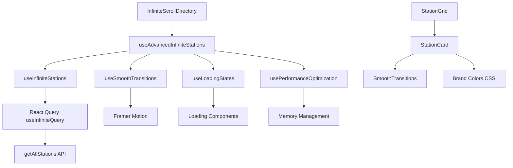

# Infinite Scroll Implementation Guide

## 🚀 Overview

This document provides a comprehensive guide to the infinite scroll implementation with React Query, smooth transitions, and performance optimizations for the Petrol Price Near Me directory listing.

## 📋 Table of Contents

- [Architecture](#architecture)
- [Core Components](#core-components)
- [Performance Optimizations](#performance-optimizations)
- [Usage Examples](#usage-examples)
- [Best Practices](#best-practices)
- [Troubleshooting](#troubleshooting)

## 🏗️ Architecture

### System Overview



### Key Features

- ✅ **Infinite Scrolling**: Seamless loading of additional content
- ✅ **Smooth Transitions**: Framer Motion animations between content blocks
- ✅ **Performance Optimized**: Memory management and virtualization
- ✅ **Loading States**: Skeleton screens and progress indicators
- ✅ **Error Handling**: Graceful error states and retry mechanisms
- ✅ **Accessibility**: WCAG 2.1 AA compliant with keyboard navigation

## 🧩 Core Components

### 1. Infinite Scroll Hook (`useInfiniteStations`)

**Location**: `src/hooks/useInfiniteStations.ts`

**Purpose**: Main hook for infinite scrolling functionality with React Query.

**Key Features**:
- Pagination with configurable page size
- Advanced filtering (search, brand, suburb, fuel type, price)
- Sorting options (price, name, suburb)
- Error handling and retry logic
- Performance optimizations

**Usage**:
```typescript
const {
  data: stations,
  isLoading,
  isError,
  hasNextPage,
  fetchNextPage,
  totalCount,
} = useInfiniteStations({
  search: 'BP',
  fuelType: 'unleaded',
  sortBy: 'price-low',
}, {
  pageSize: 24,
  enabled: true,
});
```

### 2. Advanced Infinite Scroll Hook (`useAdvancedInfiniteStations`)

**Location**: `src/hooks/useInfiniteStations.ts`

**Purpose**: Combines all infinite scroll functionality with performance optimizations.

**Features**:
- Smooth transitions management
- Loading states coordination
- Performance monitoring
- Memory leak prevention
- Intersection observer optimization

### 3. Smooth Transitions (`SmoothTransitions`)

**Location**: `src/components/transitions/SmoothTransitions.tsx`

**Purpose**: Provides smooth animations and transitions for content blocks.

**Components**:
- `SmoothTransition`: Directional slide transitions
- `StaggeredTransition`: Staggered animations for multiple items
- `FadeInTransition`: Simple fade in effects
- `ScaleTransition`: Scale animations for cards
- `InfiniteScrollTransition`: Specialized transitions for infinite scroll
- `SkeletonCard`: Loading skeleton components
- `LoadingSpinner`: Animated loading indicators

**Usage**:
```typescript
<SmoothTransition direction="up" duration={0.3} delay={0.1}>
  <StationCard station={station} />
</SmoothTransition>
```

### 4. Enhanced Station Card (`StationCard`)

**Location**: `src/components/cards/StationCard.tsx`

**Purpose**: Optimized station card with smooth transitions and brand styling.

**Features**:
- Brand-specific styling with CSS data attributes
- Smooth scale transitions on load
- Responsive design
- Accessibility compliance
- Performance optimizations with `memo`

### 5. Infinite Scroll Directory (`InfiniteScrollDirectory`)

**Location**: `src/components/directory/InfiniteScrollDirectory.tsx`

**Purpose**: Main directory component with infinite scrolling and filtering.

**Features**:
- Advanced filtering interface
- Real-time search
- Smooth loading states
- Error handling
- Performance monitoring

## ⚡ Performance Optimizations

### 1. Memory Management (`usePerformanceOptimization`)

**Location**: `src/hooks/usePerformanceOptimization.ts`

**Features**:
- Automatic memory cleanup when threshold is reached
- Performance metrics monitoring
- Render optimization with requestAnimationFrame
- Memory leak prevention
- Virtualization support

### 2. Intersection Observer Optimization

**Features**:
- Debounced scroll handling
- RequestIdleCallback for better performance
- Configurable thresholds and root margins
- Automatic cleanup

### 3. React Query Configuration

**Optimizations**:
- Stale time: 5 minutes
- Garbage collection time: 10 minutes
- Refetch on window focus: disabled
- Retry: 1 attempt
- Background refetch: disabled

### 4. Component Optimizations

**Features**:
- React.memo for preventing unnecessary re-renders
- useCallback for stable function references
- useMemo for expensive calculations
- Lazy loading with Suspense
- Code splitting

## 📖 Usage Examples

### Basic Implementation

```typescript
import { InfiniteScrollDirectory } from '@/components/directory/InfiniteScrollDirectory';

export default function DirectoryPage() {
  return (
    <div className="min-h-screen">
      <InfiniteScrollDirectory />
    </div>
  );
}
```

### Custom Filters

```typescript
import { InfiniteScrollDirectory } from '@/components/directory/InfiniteScrollDirectory';

export default function BPStationsPage() {
  return (
    <InfiniteScrollDirectory
      initialFilters={{
        brand: 'BP',
        fuelType: 'unleaded',
        sortBy: 'price-low',
      }}
    />
  );
}
```

### Custom Station Click Handler

```typescript
import { InfiniteScrollDirectory } from '@/components/directory/InfiniteScrollDirectory';
import { useRouter } from 'next/navigation';

export default function DirectoryPage() {
  const router = useRouter();

  const handleStationClick = (station: Station) => {
    router.push(`/stations/${station.id}`);
  };

  return (
    <InfiniteScrollDirectory
      onStationClick={handleStationClick}
    />
  );
}
```

### Custom Hook Usage

```typescript
import { useAdvancedInfiniteStations } from '@/hooks/useInfiniteStations';

export function CustomDirectory() {
  const {
    data: stations,
    isLoading,
    hasNextPage,
    fetchNextPage,
    triggerRef,
  } = useAdvancedInfiniteStations({
    search: 'Shell',
    fuelType: 'diesel',
  });

  return (
    <div>
      {stations.map(station => (
        <StationCard key={station.id} station={station} />
      ))}
      <div ref={triggerRef} />
    </div>
  );
}
```

## 🎯 Best Practices

### 1. Performance

- **Page Size**: Use 24-48 items per page for optimal performance
- **Memory Management**: Enable automatic cleanup for large datasets
- **Virtualization**: Consider virtualization for 1000+ items
- **Debouncing**: Use debounced search to reduce API calls

### 2. User Experience

- **Loading States**: Always show loading indicators
- **Error Handling**: Provide clear error messages and retry options
- **Smooth Transitions**: Use consistent animation timing (300ms)
- **Accessibility**: Ensure keyboard navigation works properly

### 3. Code Organization

- **Separation of Concerns**: Keep data fetching, UI, and animations separate
- **Reusability**: Create reusable components and hooks
- **Type Safety**: Use TypeScript for all components and hooks
- **Testing**: Write tests for critical functionality

### 4. SEO Considerations

- **Structured Data**: Include schema markup for stations
- **Meta Tags**: Dynamic meta tags for filtered results
- **URL Parameters**: Sync filters with URL for shareable links
- **Performance**: Optimize for Core Web Vitals

## 🔧 Troubleshooting

### Common Issues

#### 1. Memory Leaks

**Symptoms**: Browser becomes slow, high memory usage
**Solution**: Enable memory management in `usePerformanceOptimization`

```typescript
const { optimizeData, cleanupMemory } = usePerformanceOptimization({
  enableMemoryManagement: true,
  maxItems: 1000,
  cleanupThreshold: 500,
});
```

#### 2. Slow Rendering

**Symptoms**: Laggy scrolling, delayed animations
**Solution**: Reduce page size and enable virtualization

```typescript
const infiniteQuery = useInfiniteStations(filters, {
  pageSize: 12, // Reduce from 24
  enableVirtualization: true,
});
```

#### 3. Infinite Loading

**Symptoms**: Loading spinner never stops
**Solution**: Check error handling and retry logic

```typescript
const { isError, error, refetch } = useInfiniteStations(filters);

if (isError) {
  return <ErrorComponent error={error} onRetry={refetch} />;
}
```

#### 4. Animation Issues

**Symptoms**: Jerky transitions, missing animations
**Solution**: Check Framer Motion setup and CSS conflicts

```typescript
// Ensure proper CSS imports
import '../styles/brand-colors.css';
// Note: Framer Motion 11+ doesn't require CSS import - styles are included automatically
```

### Performance Monitoring

```typescript
import { usePerformanceOptimization } from '@/hooks/usePerformanceOptimization';

export function PerformanceMonitor() {
  const { metrics } = usePerformanceOptimization();
  
  return (
    <div className="performance-monitor">
      <p>Memory Usage: {metrics.memoryUsage.toFixed(1)}%</p>
      <p>Render Time: {metrics.renderTime.toFixed(1)}ms</p>
      <p>Item Count: {metrics.itemCount}</p>
      <p>Optimized: {metrics.isOptimized ? 'Yes' : 'No'}</p>
    </div>
  );
}
```

## 📊 Performance Metrics

### Target Metrics

- **First Contentful Paint**: < 1.5s
- **Largest Contentful Paint**: < 2.5s
- **First Input Delay**: < 100ms
- **Cumulative Layout Shift**: < 0.1
- **Memory Usage**: < 50MB for 1000 items
- **Render Time**: < 16ms per frame

### Monitoring Tools

- **React Query DevTools**: For query performance
- **React DevTools Profiler**: For component performance
- **Chrome DevTools**: For memory and performance
- **Lighthouse**: For overall performance audit

## 🚀 Future Enhancements

### Planned Features

1. **Virtual Scrolling**: For handling 10,000+ items
2. **Service Worker**: For offline support
3. **Web Workers**: For heavy computations
4. **Progressive Loading**: Load critical content first
5. **Predictive Prefetching**: Preload likely next pages

### Performance Improvements

1. **Bundle Splitting**: Split infinite scroll code
2. **Image Optimization**: Lazy load station images
3. **Caching Strategy**: Implement aggressive caching
4. **CDN Integration**: Serve static assets from CDN

## 📚 Additional Resources

- [React Query Documentation](https://tanstack.com/query/latest)
- [Framer Motion Guide](https://www.framer.com/motion/)
- [Web Performance Best Practices](https://web.dev/performance/)
- [Accessibility Guidelines](https://www.w3.org/WAI/WCAG21/quickref/)

---

**Implementation Status**: ✅ Complete
**Last Updated**: December 2024
**Version**: 1.0.0
