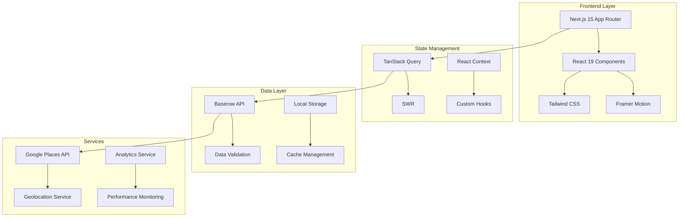

# Petrol Price Near Me 🚗⛽

> **Enterprise-level petrol station finder with real-time fuel prices for Australia**

[](https://nextjs.org/)
[](https://reactjs.org/)
[](https://www.typescriptlang.org/)
[](https://tailwindcss.com/)
[](LICENSE)

## 📋 Table of Contents

- [Overview](#overview)
- [Features](#features)
- [Architecture](#architecture)
- [Tech Stack](#tech-stack)
- [Quick Start](#quick-start)
- [Development Setup](#development-setup)
- [Project Structure](#project-structure)
- [Environment Variables](#environment-variables)
- [Testing](#testing)
- [Deployment](#deployment)
- [Performance](#performance)
- [Accessibility](#accessibility)
- [Contributing](#contributing)
- [Support](#support)

## 🎯 Overview

Petrol Price Near Me is a comprehensive, enterprise-level web application that helps users find the cheapest petrol stations in Australia. Built with modern web technologies, it provides real-time fuel price comparisons, interactive maps, and advanced search capabilities.

### Key Highlights

- 🚀 **High Performance**: Optimized for Core Web Vitals with 90+ Lighthouse scores
- ♿ **Fully Accessible**: WCAG 2.1 AA compliant with comprehensive keyboard navigation
- 📱 **Responsive Design**: Fluid layouts that work seamlessly across all devices
- 🔍 **Advanced Search**: Smart filtering and sorting with fuzzy search capabilities
- 🗺️ **Interactive Maps**: Real-time station locations with clustering and custom markers
- ⚡ **Real-time Data**: Live fuel prices updated from multiple sources
- 🌙 **Dark Mode**: System-aware theme switching with smooth transitions

## ✨ Features

### Core Functionality
- 🗺️ **Interactive Map** - Find stations on an interactive map with clustering
- 💰 **Price Comparison** - Compare fuel prices across different stations
- 📍 **Location-Based** - Find stations near your current location with geolocation
- ⛽ **Multiple Fuel Types** - Unleaded, Premium, Diesel, LPG, and more
- 🔍 **Advanced Search** - Filter by price, distance, brand, and amenities
- 📱 **Responsive Design** - Works perfectly on desktop, tablet, and mobile

### Advanced Features
- ⚡ **Real-Time Data** - Up-to-date fuel prices from multiple sources
- 🌙 **Dark Mode** - System-aware theme switching
- ♿ **Accessible** - WCAG 2.1 AA compliant with keyboard navigation
- 🚀 **Fast Performance** - Optimized for speed with lazy loading
- 📄 **Smart Pagination** - Smooth, animated page transitions
- 🎨 **Fluid Grid Layout** - Responsive design with uniform card heights
- 🔄 **ISR Support** - Incremental Static Regeneration for optimal performance
- 📊 **Analytics** - Privacy-focused analytics with user insights

## 🏗️ Architecture

### System Architecture



### Design Patterns

#### Atomic Design Structure
```
src/components/
├── atoms/           # Basic building blocks (Button, Input, Badge)
├── molecules/       # Simple combinations (SearchBar, StationCard)
├── organisms/       # Complex components (Hero, SearchSection)
├── templates/       # Page layouts (MainLayout)
└── pages/          # Full page components
```

#### Layered Architecture
```
UI Layer (Components)
    ↓
Hooks Layer (State Management)
    ↓
Service Layer (Business Logic)
    ↓
Repository Layer (Data Access)
    ↓
API Layer (External Services)
```

### Key Principles
- ✅ **Separation of Concerns** - Clear boundaries between layers
- ✅ **Single Responsibility** - Each component has one clear purpose
- ✅ **DRY (Don't Repeat Yourself)** - Reusable components and utilities
- ✅ **Type Safety** - Full TypeScript coverage
- ✅ **Testability** - Comprehensive testing strategy
- ✅ **Performance** - Optimized for speed and efficiency
- ✅ **Accessibility** - Built with accessibility in mind

## 🛠️ Tech Stack

### Core Technologies
- **Framework**: [Next.js 15](https://nextjs.org/) with App Router
- **UI Library**: [React 19](https://reactjs.org/)
- **Language**: [TypeScript 5.3](https://www.typescriptlang.org/)
- **Styling**: [Tailwind CSS 3.4](https://tailwindcss.com/)
- **Animations**: [Framer Motion](https://www.framer.com/motion/)

### State Management & Data
- **State Management**: [TanStack Query](https://tanstack.com/query) + [SWR](https://swr.vercel.app/)
- **Forms**: React Hook Form with Zod validation
- **Database**: [Baserow](https://baserow.io/) (API-based)
- **Maps**: [React Leaflet](https://react-leaflet.js.org/)

### Development & Quality
- **Testing**: [Jest](https://jestjs.io/) + [React Testing Library](https://testing-library.com/)
- **E2E Testing**: [Playwright](https://playwright.dev/)
- **Code Quality**: [ESLint](https://eslint.org/) + [Prettier](https://prettier.io/)
- **Type Checking**: [TypeScript](https://www.typescriptlang.org/)
- **Git Hooks**: [Husky](https://typicode.github.io/husky/) + [lint-staged](https://github.com/okonet/lint-staged)

### Performance & Analytics
- **Performance**: [Web Vitals](https://web.dev/vitals/) monitoring
- **Analytics**: [Vercel Analytics](https://vercel.com/analytics) + [Google Analytics](https://analytics.google.com/)
- **Bundle Analysis**: [Next.js Bundle Analyzer](https://www.npmjs.com/package/@next/bundle-analyzer)
- **Lighthouse**: Automated performance auditing

## 🚀 Quick Start

### Prerequisites

- **Node.js**: 20.x or higher
- **npm**: 9.0 or higher
- **Git**: Latest version

### Installation

1. **Clone the repository**
   ```bash
   git clone https://github.com/yourusername/petrol-price-near-me.git
   cd petrol-price-near-me
   ```

2. **Install dependencies**
   ```bash
   npm install
   ```

3. **Set up environment variables**
   ```bash
   cp .env.example .env.local
   ```

4. **Start development server**
   ```bash
   npm run dev
   ```

5. **Open your browser**
   ```
   http://localhost:3000
   ```

## 🔧 Development Setup

### Environment Variables

Create a `.env.local` file with the following variables:

```env
# Application
NEXT_PUBLIC_APP_URL=http://localhost:3000
NEXT_PUBLIC_APP_VERSION=2.0.0

# Baserow Configuration
BASEROW_API_TOKEN=your_baserow_token
BASEROW_PETROL_STATIONS_TABLE_ID=623329
BASEROW_FUEL_PRICES_TABLE_ID=623330

# Authentication (Optional)
NEXTAUTH_SECRET=your_nextauth_secret
NEXTAUTH_URL=http://localhost:3000

# Analytics (Optional)
NEXT_PUBLIC_GA_TRACKING_ID=your_ga_tracking_id
NEXT_PUBLIC_GTM_ID=your_gtm_id

# Google Places API (Optional)
NEXT_PUBLIC_GOOGLE_PLACES_API_KEY=your_google_places_key

# Performance Monitoring (Optional)
NEXT_PUBLIC_VERCEL_ANALYTICS_ID=your_vercel_analytics_id
```

### Available Scripts

| Script | Description |
|--------|-------------|
| `npm run dev` | Start development server |
| `npm run build` | Build for production |
| `npm run start` | Start production server |
| `npm run lint` | Run ESLint |
| `npm run lint:fix` | Fix ESLint issues |
| `npm run format` | Format code with Prettier |
| `npm run type-check` | Check TypeScript types |
| `npm run test` | Run tests |
| `npm run test:watch` | Run tests in watch mode |
| `npm run test:coverage` | Run tests with coverage |
| `npm run test:e2e` | Run end-to-end tests |
| `npm run analyze` | Analyze bundle size |
| `npm run lighthouse` | Run Lighthouse audit |

### Development Workflow

1. **Create a feature branch**
   ```bash
   git checkout -b feature/your-feature-name
   ```

2. **Make your changes**
   - Write code following the established patterns
   - Add tests for new functionality
   - Update documentation as needed

3. **Run quality checks**
   ```bash
   npm run quality
   ```

4. **Commit your changes**
   ```bash
   git add .
   git commit -m "feat: add your feature description"
   ```

5. **Push and create PR**
   ```bash
   git push origin feature/your-feature-name
   ```

## 📁 Project Structure

```
src/
├── app/                    # Next.js App Router pages
│   ├── api/               # API routes
│   ├── directory/         # Station directory pages
│   ├── stations/          # Individual station pages
│   └── globals.css        # Global styles
├── components/            # React components (Atomic Design)
│   ├── atoms/            # Basic UI components
│   ├── molecules/        # Composite components
│   ├── organisms/        # Complex components
│   ├── templates/        # Page layouts
│   └── common/           # Shared components
├── hooks/                # Custom React hooks
├── lib/                  # Library code and utilities
├── services/             # API services
├── types/                # TypeScript type definitions
├── utils/                # Utility functions
├── styles/               # Global styles and design system
└── data/                 # Static data files
```

### Key Directories

- **`src/components/`**: All React components organized by Atomic Design principles
- **`src/hooks/`**: Custom React hooks for state management and side effects
- **`src/lib/`**: Shared utilities, API clients, and business logic
- **`src/services/`**: External service integrations (APIs, analytics, etc.)
- **`src/types/`**: TypeScript type definitions and interfaces
- **`src/utils/`**: Pure utility functions for formatting, validation, etc.

## 🧪 Testing

### Testing Strategy

The project uses a comprehensive testing strategy with multiple levels:

#### Unit Tests
- **Framework**: Jest + React Testing Library
- **Coverage**: Components, hooks, utilities, and services
- **Location**: `src/__tests__/` and `*.test.tsx` files

#### Integration Tests
- **Framework**: Jest + React Testing Library
- **Coverage**: Component interactions and data flow
- **Location**: `src/__tests__/integration/`

#### End-to-End Tests
- **Framework**: Playwright
- **Coverage**: Critical user journeys
- **Location**: `e2e/` directory

#### Accessibility Tests
- **Framework**: Jest + jest-axe
- **Coverage**: WCAG 2.1 AA compliance
- **Location**: `src/__tests__/a11y/`

### Running Tests

```bash
# Run all tests
npm run test

# Run tests in watch mode
npm run test:watch

# Run tests with coverage
npm run test:coverage

# Run end-to-end tests
npm run test:e2e

# Run accessibility tests
npm run test:a11y
```

### Test Configuration

- **Jest**: Configured in `jest.config.js`
- **Playwright**: Configured in `playwright.config.ts`
- **Coverage**: Minimum 80% coverage required
- **CI/CD**: Tests run automatically on every PR

## 🚀 Deployment

### Production Deployment

#### Vercel (Recommended)

1. **Connect to Vercel**
   - Import project from GitHub
   - Configure environment variables
   - Deploy automatically

2. **Environment Variables**
   ```bash
   # Set in Vercel dashboard
   BASEROW_API_TOKEN=your_production_token
   NEXT_PUBLIC_APP_URL=https://your-domain.com
   # ... other variables
   ```

3. **Custom Domain** (Optional)
   - Configure custom domain in Vercel dashboard
   - Update DNS settings as instructed

#### Docker Deployment

1. **Build Docker image**
   ```bash
   docker build -t petrol-price-app .
   ```

2. **Run container**
   ```bash
   docker run -p 3000:3000 petrol-price-app
   ```

#### Manual Deployment

1. **Build for production**
   ```bash
   npm run build
   ```

2. **Start production server**
   ```bash
   npm run start
   ```

### Deployment Checklist

- [ ] Environment variables configured
- [ ] Database connections tested
- [ ] Performance optimizations enabled
- [ ] Analytics configured
- [ ] Error monitoring set up
- [ ] SSL certificate installed
- [ ] CDN configured (if applicable)

## ⚡ Performance

### Performance Optimizations

#### Core Web Vitals
- **LCP (Largest Contentful Paint)**: < 2.5s
- **FID (First Input Delay)**: < 100ms
- **CLS (Cumulative Layout Shift)**: < 0.1

#### Optimization Strategies
- **Code Splitting**: Automatic route-based splitting
- **Lazy Loading**: Components and images loaded on demand
- **Image Optimization**: Next.js Image component with WebP/AVIF
- **Bundle Optimization**: Tree shaking and dead code elimination
- **Caching**: Aggressive caching for static assets
- **CDN**: Global content delivery network

#### Performance Monitoring
- **Web Vitals**: Real-time performance monitoring
- **Lighthouse**: Automated performance auditing
- **Bundle Analysis**: Regular bundle size monitoring
- **Core Web Vitals**: Google Search Console integration

### Performance Commands

```bash
# Run Lighthouse audit
npm run lighthouse

# Analyze bundle size
npm run analyze

# Performance audit
npm run performance:audit
```

## ♿ Accessibility

### Accessibility Features

- **WCAG 2.1 AA Compliant**: Meets accessibility standards
- **Keyboard Navigation**: Full keyboard support
- **Screen Reader Support**: Semantic HTML and ARIA labels
- **Color Contrast**: High contrast ratios for readability
- **Focus Management**: Clear focus indicators
- **Alternative Text**: Descriptive alt text for images

### Accessibility Testing

```bash
# Run accessibility tests
npm run test:a11y

# Check accessibility with Lighthouse
npm run lighthouse -- --only-categories=accessibility
```

### Accessibility Guidelines

1. **Semantic HTML**: Use proper HTML elements
2. **ARIA Labels**: Provide descriptive labels
3. **Keyboard Navigation**: Ensure all functionality is keyboard accessible
4. **Color Contrast**: Maintain high contrast ratios
5. **Focus Management**: Clear focus indicators and logical tab order

## 🤝 Contributing

### Getting Started

1. **Fork the repository**
2. **Create a feature branch**
   ```bash
   git checkout -b feature/amazing-feature
   ```
3. **Make your changes**
4. **Run tests**
   ```bash
   npm run test
   ```
5. **Commit your changes**
   ```bash
   git commit -m "feat: add amazing feature"
   ```
6. **Push to your branch**
   ```bash
   git push origin feature/amazing-feature
   ```
7. **Open a Pull Request**

### Development Guidelines

#### Code Style
- Use TypeScript for all new code
- Follow ESLint and Prettier configurations
- Write meaningful commit messages
- Add tests for new functionality

#### Component Guidelines
- Follow Atomic Design principles
- Use semantic HTML elements
- Implement proper accessibility features
- Write comprehensive tests

#### Pull Request Process
1. Ensure all tests pass
2. Update documentation as needed
3. Request review from maintainers
4. Address feedback promptly

### Code of Conduct

This project follows the [Contributor Covenant](https://www.contributor-covenant.org/) code of conduct. Please read and follow these guidelines when contributing.

## 📞 Support

### Getting Help

- **Documentation**: Check this README and inline code comments
- **Issues**: [GitHub Issues](https://github.com/yourusername/petrol-price-near-me/issues)
- **Discussions**: [GitHub Discussions](https://github.com/yourusername/petrol-price-near-me/discussions)
- **Email**: contact@petrolpricenearme.com.au

### Contact Information

- **Developer**: Al T
- **Mobile**: 0423 530 204
- **Email**: contact@petrolpricenearme.com.au
- **Website**: https://petrolpricenearme.com.au

### Reporting Issues

When reporting issues, please include:
- Description of the problem
- Steps to reproduce
- Expected behavior
- Actual behavior
- Browser and device information
- Screenshots (if applicable)

## 📄 License

This project is licensed under the MIT License - see the [LICENSE](LICENSE) file for details.

## 🙏 Acknowledgments

- **Next.js Team** - For the amazing framework
- **Vercel** - For hosting and analytics
- **Baserow** - For the database solution
- **OpenStreetMap** - For map tiles
- **All Contributors** - For their valuable contributions

## 🗺️ Roadmap

### Upcoming Features
- [ ] Mobile app (React Native)
- [ ] Price alerts and notifications
- [ ] User accounts and favorites
- [ ] Price history and trends
- [ ] API for developers
- [ ] Integration with fuel card providers

### Performance Improvements
- [ ] Service Worker implementation
- [ ] Advanced caching strategies
- [ ] Image optimization improvements
- [ ] Bundle size reduction

### Developer Experience
- [ ] Storybook documentation
- [ ] Component testing improvements
- [ ] CI/CD pipeline enhancements
- [ ] Developer tooling improvements

---

**Made with ❤️ in Australia**

*Find the cheapest petrol prices near you with our comprehensive, accessible, and performant web application.*
